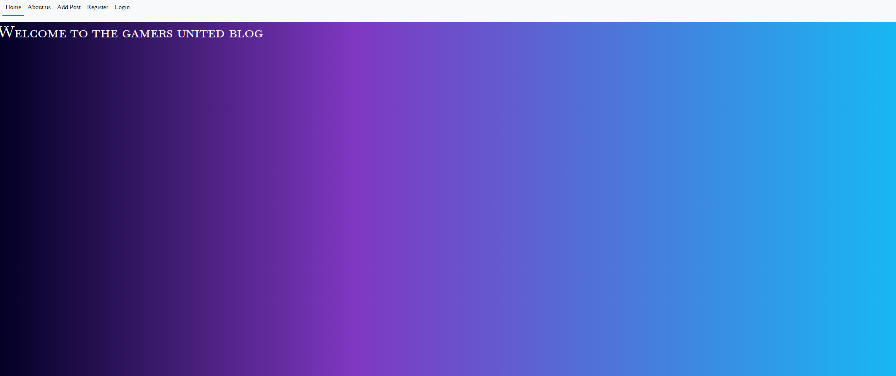
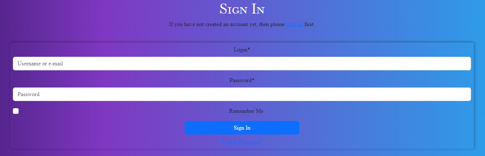
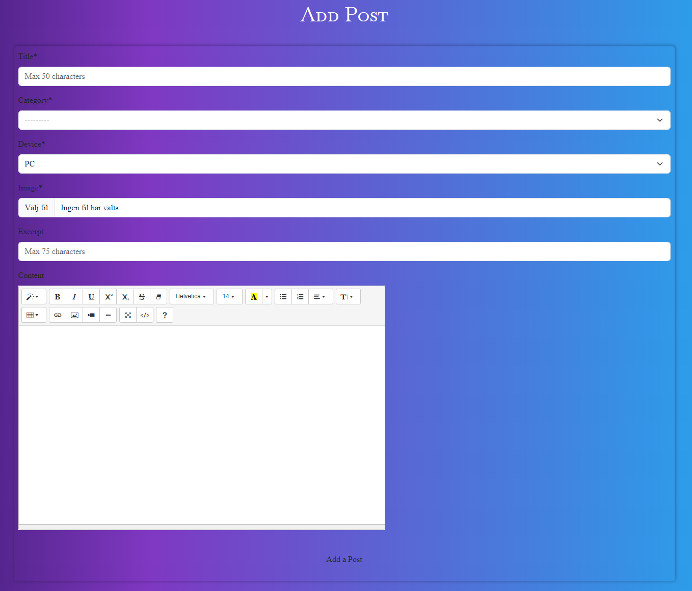

# Gamers United
# Gamers United - Your Ultimate Gaming Hub

Welcome to **Gamers United**, a gaming blog designed for enthusiasts to share their love for video games. Whether you're into analyzing the intricacies of game mechanics, reviewing the latest titles, or simply discussing your favorite gaming moments, this platform has something for everyone. 

With **Gamers United**, you can easily create and share blog posts, offering your unique insights on everything from game graphics to storylines and overall gameplay experiences. Our user-friendly interface makes it simple to discover new content, interact with other gamers, and contribute to a thriving community passionate about gaming.

Join us in building a space where every gamer’s voice can be heard, and where thoughtful discussions and diverse perspectives on the gaming world come together. Dive into **Gamers United** and start sharing your gaming journey today!

 

 

Developer: [Elena Hanna](https://github.com/KimBergstroem)  
[Live webpage](https://8000-enzolita-gamersunited-3298nwdsxm9.ws.codeinstitute-ide.net/) 
[Project Repository](https://github.com/Enzolita/gamers-united) 

# Project Goals 

Gamers United is a Django web application focused on building a dynamic platform where gamers can share their insights, opinions, cheat codes, and experiences related to various games. The core objectives of this project include:
The key objectives of the project include:

- **Supporting Gamers:** Creating a dedicated space for gamers to contribute their reviews, articles, and discussions about different games.
- **User Experience:** Providing an engaging and intuitive interface that encourages users to explore content and interact with the community.
- **Content Organization:** Enabling users to effectively categorize and manage their articles, reviews, and discussions.
- **User Profiles:** Allowing users to create personalized profiles, highlight their gaming preferences, and track their contributions.
- **Active Participation:** Encouraging user interactions through comments, reviews, and discussions to build a strong sense of community.
- **Administrator Control:** Giving administrators the tools to manage user accounts, moderate content, and maintain a safe environment.

### User Goals
- Exploring and sharing detailed game reviews and articles.
- Personalizing their profiles to showcase their gaming interests.
- Engaging in discussions and leaving comments to contribute to the gaming community.
- Saving favorite articles and reviews for easy access.
- Submitting their own game reviews, articles, and insights.

### Site Owner Goals

- Offering a space for gamers to share their perspectives and insights.
- Curating a wide variety of gaming content to meet diverse tastes.
- Building a vibrant gaming community where users can connect and exchange experiences.
- Moderating user-generated content to maintain quality and appropriateness.
- Boosting user interaction and engagement through intuitive design and features.

 Project **Gamers United** is dedicated to developing a vibrant community where gamers can connect, share, and delve into the gaming world through thoughtful articles, discussions, and reviews.

(<a href="#table-of-content">back to top</a>)

  

# User Experience

### Target Audience

Gamers United caters to:

- Passionate gamers and enthusiasts seeking detailed game insights and reviews.
- Individuals eager to explore a wide range of gaming experiences and genres.
- Users interested in sharing their own game reviews, opinions, and personal experiences.
- Players looking for a platform to engage in discussions about their favorite titles.
- Those who want to keep up with the latest trends and conversations in the gaming world.

### User Requirements and Expectations

Users of **Gamers United** can anticipate the following features and attributes to meet their needs:

- An intuitive and user-friendly interface that facilitates easy navigation and access to gaming content.
- In-depth game reviews and articles that provide thorough analysis and opinions.
- A responsive design that ensures an attractive and functional experience across various devices.
- Personalized elements, such as user profiles, that highlight gaming preferences and track individual contributions.
- Opportunities for interactive participation through comments and discussions to build a strong community.
- Timely notifications about new content and discussions to keep users updated and engaged.

**Gamers United** is dedicated to offering an engaging and immersive platform for users to explore, share, and discuss their love for gaming.

### User Stories

#### Epic 1: User Experience (Visitor)

- [Easily Navigate and Find Content (should-have)](---) #1 SPRINT 2
- [Visually Appealing Homepage (should-have)](--) #2 SPRINT 2
- [Search for Specific Games or Topics (could-have)](--) #3 SPRINT 2
- [Create a Personalized Profile (should-have)](--) #5 SPRINT 3

#### Epic 2: User Engagement and Interaction (Registered User)

- [Read Detailed Game Reviews (should-have)](--) #4 SPRINT 3
- [Save Favorite Articles and Create Reading Lists (should-have)](--) #6 SPRINT 3
- [Receive Notifications (could-have)](--) #7 SPRINT 4
- [Leave Comments and Engage in Discussions (must-have)](--) #8 SPRINT 4
- [Submit Own Articles and Reviews (must-have)](--) #9 SPRINT 4
- [Edit or Delete Own Articles and Comments (must-have)](--) #10 SPRINT 4
- [Earn Badges or Rewards (won't-have)](--) #11 SPRINT 4
- [Create Personalized Gaming Profile (should-have)](--) #16 SPRINT 4
- [Save Favorite Articles and Create Reading List (could-have)](--) #17 SPRINT 3

#### Epic 3: Administration and Content Management (Admin/Content Moderator)

- [Full Control Over User Accounts (must-have)](--) #12 SPRINT 4
- [Review and Edit User-Submitted Articles (must-have)](--) #13 SPRINT 4
- [Manage and Categorize Articles (could-have)](--) #14 SPRINT 4
- [Track User Engagement and Analytics (could-have)](--) #15 SPRINT 4

 

The user stories and epics are organized into four distinct sprints (milestones) to establish a well-defined work structure. You can access the details of these sprints by clicking [here](--), which will redirect you to the sprint information.

 

(<a href="#table-of-content">back to top</a>)

  

# Database
When creating the database structure schema for this project, I utilized the [lucidchart.com](https://lucidchart.com/) website. This online tool allowed me to visually design and document the database schema, making it easier to plan and implement the database for the blog application.

 

 

### Blog Application Database Schema

#### GameCategory Table
- Stores game categories used for categorizing posts.
- Fields: gamecategory_id (primary key), name (category name), device (category device).

#### UserProfile Table
- Extends the User model to store additional user-specific information.
- Fields: userprofile_id (primary key), user (one-to-one relationship with the User model), first_name, last_name, profile_picture (user profile picture), bio (user bio), country (user's country).

#### User Table
- Represents user information. ( Django built In )
- Fields: user_id (primary key), username (user's name), email (user's email address), password (user's password).

#### Post Table
- Represents blog posts created by users.
- Fields: post_id (primary key), title (post title), slug (post slug), author_id (foreign key to User), update_on (post update date), content (post content), featured_image (featured image URL), excerpt (post excerpt), Created_on (post creation date), status (post status), likes (many-to-many relationship with User for post likes), category_id (foreign key to GameCategory), device (post device 'PC', 'XBOX', 'PLAYSTATION', 'NITENDO', Charfield).

#### Comment Table
- Represents comments on blog posts.
- Fields: comment_id (primary key), post_id (foreign key to Post), name (commenter's name), email (commenter's email address), body (comment content), created_on (comment creation date), approved (comment approval status), user_id (foreign key to user model).

 
This database schema defines the structure and relationships for a blog application, including users, posts, comments, user profiles, game categories, and follower relationships.

(<a href="#table-of-content">back to top</a>)

  

# Design
In the world of **Gamers United**, the design philosophy revolves around creating a modern and streamlined user interface that highlights gaming insights. Drawing inspiration from the immersive environments of video games, the aim is to offer a visually engaging experience. The primary objective is to ensure effortless navigation, discovery, and interaction with a rich array of gaming articles.

### Design Choices
Our design choices were thoughtfully made with gamers at the forefront, resulting in an environment that authentically reflects the spirit of the gaming community.

### Color
The goal with the colors are to make it a cozy environment with a gradient background that includes different shades.

### Fonts

**Gamers United** utilizes the default fonts provided by Bootstrap 5, which enhance both the visual appeal and user experience of the site without additional customization.

### Structure

The website is designed with a user-friendly structure to ensure smooth navigation and easy access to content. Here's a summary of the site layout:

#### Before Logging In:

- **Landing Page:** The landing page introduces visitors to **Gamers United**, showcasing the platform and highlighting the engaging content and features available. 
- **About Us:** The About Us page offers insight into **Gamers United**, including our mission, values, and the advantages of being part of our active gaming community. 
- **Sign Up:** New users can quickly create an account on the Join Us page by providing the necessary information to join **Gamers United**. 
- **Log In:** Existing users can access their accounts and explore the full range of features by logging in through this page. 

#### After Logging In:

Once you're logged into **Gamers United**, you'll be immersed in our vibrant gaming community with access to the following pages:

- **Home Page (Gamer's Hub):** This is your gateway to the latest gaming blog posts. The Gamer's Hub serves as a central hub, offering a rich array of gaming articles and content. 
- **Profile Page:** Here, you can manage your gaming identity. Display your bio, showcase your achievements, and personalize your avatar. Tailor your profile settings to reflect your unique gaming persona. 
- **Contact Us:** Should you have any questions or encounter issues, our support team is ready to help. Reach out via the "Contact Us" page for assistance with any concerns or inquiries. 

We’ve designed this space to be your premier gaming hub, where you can engage, explore, and exchange insights with other gaming enthusiasts.

#### Profile Navigation:

Clicking on your profile image in the navigation bar gives you access to various profile-specific features:

- **My Articles:** The "My articles" page is your personal dashboard. Here, you can view and manage the articles and contributions you've made to **Gamers United**. 
- **Create Post:** Eager to share your gaming knowledge? The "Create Post" page lets you draft and publish your own articles, contributing your unique insights and experiences to the community. Showcase the tips and tricks you've discovered in your favorite games! 
- **Log Out:** When you're ready to end your session, click "Log Out" to securely exit and transition back to reality after your immersive gaming journey. 

### Wireframes

Create Post View

Phone View

(<a href="#table-of-content">back to top</a>)

  

# Technologies Used

### Languages
- HTML
- CSS
- Python

### Frameworks
- Django: A high-level Python web framework used for building the Gamers United Blog web application.
- Crispy Forms: A Django package used for rendering forms in a more efficient and customizable way.
- Bootstrap v5.3: A popular CSS framework used for creating responsive and visually appealing user interfaces.
- Cloudinary: A cloud-based media management platform used for storing and serving images in the Blog Collective project.

### Database
- ElephantSQL: ElephantSQL is a PostgreSQL database as a service. It is used as the database for the Blog Collective project, providing a reliable and scalable storage solution for the application's data.

### Tools
- **Git**: A distributed version control system used for tracking changes in the project's source code.
- **GitHub**: A web-based hosting service for version control repositories, used for storing and managing the project's source code.
- **Gitpod**: An online integrated development environment (IDE) used for developing and testing the Gamers United project.
- **Heroku**: A cloud platform that enables deployment and hosting of web applications. Heroku was used for deploying the Gamers United project to a live server.
- **Lucid Chart**: An online database design and diagramming tool that simplifies the process of creating and visualizing database schemas. lucidchart.com was used for designing and documenting the database schema of the Gamers United project.
- **Google Fonts**: A collection of free and open-source fonts used for typography on Gamers United website.
- **Uxwing**: A library of icons used for adding scalable vector icons to Gamers United website.

### Supporting Libraries and Packages
- asgiref==3.8.1
- black==23.1.0
- certifi==2022.12.7
- cffi==1.15.1
- charset-normalizer==3.1.0
- click==8.1.3
- cloudinary==1.32.0
- colorama==0.4.6
- crispy-bootstrap5==0.7
- cryptography==39.0.2
- defusedxml==0.7.1
- Django==5.1
- django-allauth==0.53.0
- django-cloudinary-storage==0.3.0
- django-crispy-forms==2.0
- django-reorder==0.2.1
- django-resized==1.0.2
- django-richtextfield==1.6.1
- idna==3.4
- mypy-extensions==1.0.0
- oauthlib==3.2.2
- packaging==23.2
- pathspec==0.11.1
- Pillow==9.4.0
- platformdirs==3.9.1
- pycparser==2.21
- PyJWT==2.6.0
- python3-openid==3.2.0
- requests==2.32.3
- requests-oauthlib==1.3.1
- six==1.16.0
- sqlparse==0.4.3
- tomli==2.0.1
- tzdata==2022.7
- urllib3==1.26.15

(<a href="#table-of-content">back to top</a>)

  

# Methodology

The Gamers United project follows a methodology inspired by agile principles, fostering collaboration, flexibility, and gradual development. The outlined approach has guided the project's evolution:

### Agile Project Management with GitHub Projects
To streamline project management, GitHub Projects is employed as a central hub. User stories and tasks are structured as GitHub issues, creating an organized workflow. The GitHub project board serves as a visual representation, tracking progress effectively.

### User Stories as GitHub Issues
Transforming user stories into GitHub issues captures user-centric functionalities. These issues interlink with respective user stories, simplifying access to criteria, tasks, and discussions.

### Bug Tracking for Seamless Development
Bugs uncovered during development are documented as GitHub issues, offering insights into each bug's characteristics, impact, and reproduction steps. By hyperlinking these issues in README.md, users can stay updated on bug resolutions and contribute insights.

### Iterative Development Approach
--

### Future Backlog and Progress
---

**Labels and User Story Distribution (MoSCoW):**

- **Must-Have:** -
- **Should-Have:** -
- **Could-Have:** -
- **Wont-Have:** -
- **Task:** -

For a comprehensive view of the project's trajectory, user stories, and bug tracking, explore the [Kanban board](-).

(<a href="#table-of-content">back to top</a>)

  

# Features
### Landing Page:
- On the landing page, a prominent blue call-to-action button invites users to register and join our exclusive VIP blogging community. Additionally, a captivating hero image featuring a magic book is strategically positioned to immediately capture the user's attention and evoke the essence of the blogging experience.

See Screenshot **Landingpage**

- Visitors can easily navigate to different sections available for unauthorized users of the website through the navigation bar. Visitors can also access our social media through the footer section.

See Screenshot **Navbar**

See Screenshot **Footer**

### Blog Pages:
- When the user has logged in they will be directed to the Blog main page where they can scroll through blog article cards. 

See Screenshot **Main**

### Blog Detail Page:
- The blog details page displays comprehensive information about each article, including details about the writer and the article's creation date.

See Screenshot **Post detail**

- Authors of posts have the privilege to edit or delete their content, ensuring they have control over their contributions.

See Screenshot **Editing**

See Screenshot **Delete**

- Users can express their appreciation for a well-written blog post by liking it, which not only supports the author but also recognizes the quality of the content.

See Screenshot **Like**

- Users can actively participate in the community by leaving comments on recipes. This provides a platform for sharing thoughts, suggestions, and feedback, fostering a vibrant and engaging community. Users also have the option to delete comments.

See Screenshot **Comment**

### User Account Management:
- The account sign-up form allows new users to create an account and join the Gamers United community. The form has validation to make sure that the user enters the correct information needed. This is a Django built-in validation system. Such validation is:

    - **Username**: Required and has a maximum of 150 characters or fewer. Only letters, digits, and @/./+/-/_ are allowed.
    - **Email**: Required and must be in a valid email format.
    - **Password**: Subject to the following constraints:
        - Cannot be too similar to your other personal information.
        - Must contain at least 8 characters.
        - Cannot be a commonly used password.
        - Cannot be entirely numeric.
    - See Screenshot

**SIGNUP VALIDATION**

- The login form ensures secure access to Gamers United by verifying your username and password. If you face login issues, use the 'Forgot Password?' link to reset your password. The form also displays validation error messages to guide you through any input errors.
    - See Screenshot

**LOGIN VALIDATION**

- When an account is successfully created, the user will receive a confirmation message and gain access to the profile menu.

See Screenshot **Success**

- Users can create posts.

See Screenshot **Create Post**

- Users can access their profile page, where they can edit, delete, or change their password.

See Screenshot **My Profile**

See Screenshot **Update Profile**

See Screenshot **Change Password**

See Screenshot **Delete Account**

- Users can view all their articles on a single page. This page will also display all user's Liked articles. If there is no post created or liked, that will be displayed.

See Screenshot **My Articles**

See Screenshot **None Articles/Likes**

- Users can also use the "Logout" option to sign out of their accounts. Upon doing so, they will be directed to a confirmation page where they can confirm the logout.

See Screenshot **Logout**

### Navigation:
- The navigation bar provides convenient access to various sections and pages of Gamers United, dynamically adjusting its options based on the user's authorization status. Authorized users also have the ability to submit queries to Gamers United using the Contact Us form. Users will have a confirmation message when successfully submit the form.

See Screenshot **Contact Us**

See Screenshot **Contact Us Submitted**

- Both unauthorized and authorized users have access to the About Us page. However, depending on whether you are logged in or not, the call-to-action button displayed varies between "Log In" and "Create Post."

See Screenshot **About Us Authorized**

See Screenshot **About Us Unauthorized**

- On smaller screens, the navigation bar collapses into a burger menu, allowing for a compact and mobile-friendly navigation experience. Users can access the menu by clicking on the burger icon, which reveals the navigation options in a dropdown fashion.

### Future Features

Here are some exciting enhancements we plan to introduce to **Gamers United**:

- **Favorites and Save for Later:**  
  Allow users to mark blog articles as favorites or save them for later reading, making it easier to revisit content.

- **Effortless Social Media Sharing:**  
  Enable users to easily share their favorite blog posts across various social media platforms, increasing the reach and visibility of **Gamers United**.

- **Multilingual Capabilities:**  
  Add support for multiple languages to make **Gamers United** accessible to a global audience and foster a more inclusive experience.

- **Email Verification for Account Creation:**  
  Implement email verification during account setup to improve security and ensure user authenticity.

- **Password Recovery Options:**  
  Introduce a password recovery feature to allow users to securely reset their passwords and regain access to their accounts.

(<a href="#table-of-content">back to top</a>)

  

# Testing

---

All testing, including both manual and automated testing, was carried out and documented in [Testing.md](TESTING.md). 

(<a href="#table-of-content">back to top</a>)

  

# Bugs
--

### Known bugs

| **Bug** | **Description** |
| ------- | --------------- |
| [-](http) | ---- |
| [-](http) | ---- |
| [-](https) | ----- |
| [-](http) | ---- |
| [-](http) | ---- |

### Fixed bugs

| **Bug** | **Fix** |
| ------- | ------- |
| [-](http) | --- |
| [-](http) | --- |
| [-](http) | --- |
| [-](http) | --- |
| [-](http) | --- |
| [-](http) | --- | -- |

(<a href="#table-of-content">back to top</a>)

  

