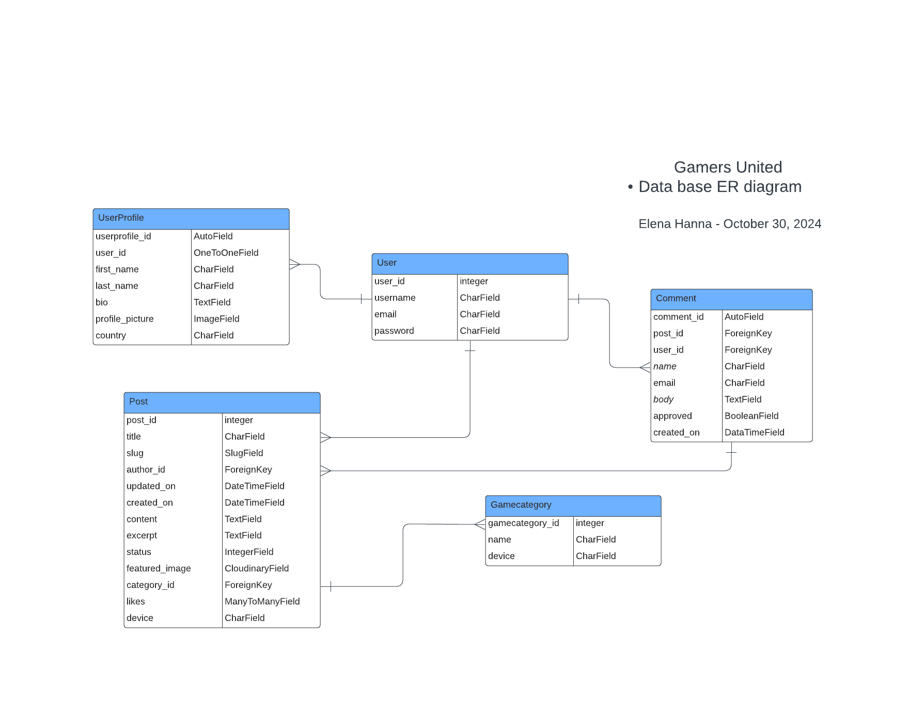
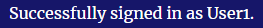

# Gamers United - Your Ultimate Gaming Hub

Welcome to **Gamers United**, a gaming blog designed for enthusiasts to share their love for video games. Whether you're into analyzing the intricacies of game mechanics, reviewing the latest titles, or simply discussing your favorite gaming moments, this platform has something for everyone. 

With **Gamers United**, you can easily create and share blog posts, offering your unique insights on everything from game graphics to storylines and overall gameplay experiences. Our user-friendly interface makes it simple to discover new content, interact with other gamers, and contribute to a thriving community passionate about gaming.

Join us in building a space where every gamer’s voice can be heard, and where thoughtful discussions and diverse perspectives on the gaming world come together. Dive into **Gamers United** and start sharing your gaming journey today!

<center> 

 

</center>


Developer: [Elena Hanna](https://github.com/Enzolita) <br>
[Live webpage](https://gamers-united-63fd4bb05519.herokuapp.com/)<br>
[Project Repository](https://github.com/Enzolita/gamers-united)<br>


## Table of Content

- 📄[Project Goals](#project-goals)
  + [User Goals](#user-goals)
  + [Site Owner Goals](#site-owner-goals)
- 📄[User Experience](#user-experience)
  + [Target Audience](#target-audience)
  + [User Requirements and Expectations](#user-requirements-and-expectations)
  + [User Stories](#user-stories)
    - [Epic 1: User Experience (Visitor)](#epic-1--user-experience--visitor-)
    - [Epic 2: User Engagement and Interaction (Registered User)](#epic-2--user-engagement-and-interaction--registered-user-)
    - [Epic 3: Administration and Content Management (Admin/Content Moderator)](#epic-3--administration-and-content-management--admin-content-moderator-)
- 📄[Database](#database)
  + [Blog Application Database Schema](#blog-application-database-schema)
    - [GameCategory Table](#gamecategory-table)
    - [UserProfile Table](#userprofile-table)
    - [User Table](#user-table)
    - [Post Table](#post-table)
    - [Comment Table](#comment-table)
- 📄[Design](#design)
  + [Design Choices](#design-choices)
  + [Color](#color)
  + [Fonts](#fonts)
  + [Structure](#structure)
    - [Before Logging In:](#before-logging-in-)
    - [After Logging In:](#after-logging-in-)
    - [Profile Navigation:](#profile-navigation-)
  + [Wireframes](#wireframes)
- 📄[Technologies Used](#technologies-used)
  + [Languages](#languages)
  + [Frameworks](#frameworks)
  + [Database](#database-1)
  + [Tools](#tools)
  + [Supporting Libraries and Packages](#supporting-libraries-and-packages)
- 📄[Methodology](#methodology)
  + [Agile Project Management with GitHub Projects](#agile-project-management-with-github-projects)
  + [User Stories as GitHub Issues](#user-stories-as-github-issues)
  + [Bug Tracking for Seamless Development](#bug-tracking-for-seamless-development)
  + [Iterative Development Approach](#iterative-development-approach)
  + [Future Backlog and Progress](#future-backlog-and-progress)
- 📄[Features](#features)
  + [Landing Page:](#landing-page-)
  + [Blog Pages:](#blog-pages-)
  + [Blog Detail Page:](#blog-detail-page-)
  + [User Account Management:](#user-account-management-)
  + [Navigation:](#navigation-)
  + [Future Features](#future-features)
- 📄[Testing](#testing)
- 📄[Bugs](#bugs)
  + [Known bugs](#known-bugs)
  + [Fixed bugs](#fixed-bugs)
- 📄[Deployment](#deployment)
  + [App Deployment](#app-deployment)
  + [Cloudinary](#cloudinary)
  + [Version Control](#version-control)
  + [Forking the Repository:](#forking-the-repository-)
  + [Clone of the Repository:](#clone-of-the-repository-)
- 📄[Credits](#credits)
  + [Media](#media)
  + [Django Documentation:](#django-documentation-)
  + [W3 Schools:](#w3-schools-)
  + [Bootstrap docs:](#bootstrap-docs-)
  + [Geeksforgeeks:](#geeksforgeeks-)
  + [Various tutorials and YouTube channels:](#various-tutorials-and-youtube-channels-)
  + [Content](#content)
- 📄[Acknowledgments](#acknowledgments)


# Project Goals 

Gamers United is a web application built with Django, designed to offer a vibrant platform for gamers to connect and share their knowledge, tips, cheat codes, and personal gaming experiences. This project focuses on the following key goals:
This project focuses on the following key goals:

- **Supporting Gamers:** Creating a dedicated space for gamers to contribute their reviews, posts, and discussions about different games.
- **Seamless User Experience:** Delivering an intuitive and engaging interface that encourages exploration and active participation within the community.
- **Content Organization:**  Allowing users to organize and manage their posts, reviews, and discussions effectively.

- **Personalized Profiles:** Enabling users to showcase their gaming interests, track contributions, and customize their profiles.
- **Community Engagement:** Fostering meaningful interactions through comments, discussions, and collaborative reviews to strengthen the community spirit.
- **Administrative Oversight:**  Equipping administrators with tools to manage user accounts, moderate content, and ensure a safe and welcoming environment.


### User Goals
- Exploring and sharing detailed game reviews and posts.
- Personalizing their profiles to showcase their gaming interests.
- Engaging in discussions and leaving comments to contribute to the gaming community.
- Submitting their own game reviews, posts, and perspectives.


### Site Owner Goals

- Offering a space for gamers to share their perspectives and thoughts.
- Curating a wide variety of gaming content to meet diverse tastes.
- Building a vibrant gaming community where users can connect and exchange experiences.
- Moderating user-generated content to maintain quality and appropriateness.
- Boosting user interaction and engagement through intuitive design and features.

 Project **Gamers United** is dedicated to developing a vibrant community where gamers can connect, share, and delve into the gaming world through thoughtful posts, discussions, and reviews.

<p align="right">(<a href="#table-of-content">back to top</a>)</p>

# User Experience

### Target Audience

Gamers United caters to:

- Passionate gamers and enthusiasts seeking detailed game insights and reviews.
- Individuals eager to explore a wide range of gaming experiences and genres.
- Users interested in sharing their own game reviews, opinions, and personal experiences.
- Players looking for a platform to engage in discussions about their favorite games.
- Those who want to keep up with the latest trends and conversations in the gaming world.


### User Requirements and Expectations

Users of **Gamers United** can anticipate the following features and attributes to meet their needs:

- An intuitive and user-friendly interface that facilitates easy navigation and access to gaming content.
- In-depth game reviews and posts that provide thorough analysis and opinions.
- A responsive design that ensures an attractive and functional experience across various devices.
- Personalized elements, such as user profiles, that highlight gaming preferences and track individual contributions.
- Opportunities for interactive participation through comments and discussions to build a strong community.


**Gamers United** is dedicated to offering an engaging and immersive platform for users to explore, share, and discuss their passion for gaming.


# User Stories

### Agile Planning and Development

<br>

At Gamers United, our planning and development process is guided by Agile methodologies and principles. While we don't strictly follow traditional Agile frameworks like scheduled sprints or scrums, we emphasize flexibility, continuous improvement, and swift adaptation to change. Instead of focusing on sprints, we prioritize developing epics that align with backend applications, addressing User Stories based on their priority.

Our overarching strategy divides the project into three key phases: planning, development (which includes unit and functional testing), and continuous deployment. Documentation is created, reviewed, and updated throughout the process. Our approach is straightforward: we develop features in a logical order, prioritizing core functionalities before moving on to more complex aspects.

We actively seek and analyze user feedback to pinpoint areas for improvement, ensuring that our product continuously evolves to meet user needs and expectations effectively.

We used a project [kanban board](https://github.com/users/Enzolita/projects/7) to track progress.

<br>


<p align="right">(<a href="#table-of-content">back to top</a>)</p>
<p align="center">
  
</p>

# Database
When creating the database structure schema for this project, I utilized the [lucidchart.com](https://lucidchart.com/) website. This online tool allowed me to visually design and document the database schema, making it easier to plan and implement the database for the blog application.

<center> 

 

</center>

### Blog Application Database Schema

#### GameCategory Table
- Stores game categories used for categorizing posts.
- Fields: gamecategory_id (primary key), name (category name), device (category device).

#### UserProfile Table
- Extends the User model to store additional user-specific information.
- Fields: userprofile_id (primary key), user (one-to-one relationship with the User model), first_name, last_name, profile_picture (user profile picture), bio (user bio), country (user's country).

#### User Table
- Represents user information. ( Django built In )
- Fields: user_id (primary key), username (user's name), email (user's email address), password (user's password).

#### Post Table
- Represents blog posts created by users.
- Fields: post_id (primary key), title (post title), slug (post slug), author_id (foreign key to User), update_on (post update date), content (post content), featured_image (featured image URL), excerpt (post excerpt), Created_on (post creation date), status (post status), likes (many-to-many relationship with User for post likes), category_id (foreign key to GameCategory), device (post device 'PC', 'XBOX', 'PLAYSTATION', 'NITENDO-SWITCH', Charfield).

#### Comment Table
- Represents comments on blog posts.
- Fields: comment_id (primary key), post_id (foreign key to Post), name (commenter's name), email (commenter's email address), body (comment content), created_on (comment creation date), approved (comment approval status), user_id (foreign key to user model).

<br>
This database schema defines the structure and relationships for a blog application, including users, posts, comments, user profiles, game categories.
<p align="right">(<a href="#table-of-content">back to top</a>)</p>
  

# Design
In the world of **Gamers United**, the design philosophy revolves around creating a modern and streamlined user interface that highlights gaming reviews. Drawing inspiration from the immersive environments of video games, the aim is to offer a visually engaging experience. The primary objective is to ensure effortless navigation, discovery, and interaction with a rich array of gaming posts.

### Design Choices
Our design choices were thoughtfully made with gamers at the forefront, resulting in an environment that authentically reflects the spirit of the gaming community.

### Color
The color scheme aims to evoke a cozy and welcoming atmosphere, featuring a dark, earth-inspired background symbolizing the unity of gamers from all around the world. Hence Gamers United.


### Fonts

**Gamers United** utilizes the default fonts provided by Bootstrap 5, which enhance both the visual appeal and user experience of the site without additional customization.

### Structure

The website is designed with a user-friendly structure to ensure smooth navigation and easy access to content. Here's a summary of the site layout:

#### Before Logging In:

- **Landing Page:** The landing page introduces visitors to **Gamers United**, showcasing the platform and highlighting the engaging content and features available.<br>
- **About Us:** The About Us page offers insight into **Gamers United**, including our mission, values, and the advantages of being part of our active gaming community.<br>
- **Sign Up:** New users can quickly create an account on the Join Us page by providing the necessary information to join **Gamers United**.<br>
- **Log In:** Existing users can access their accounts and explore the full range of features by logging in through Log In page.<br>


#### After Logging In:

Once you're logged into **Gamers United**, you'll be immersed in our vibrant gaming community with access to the following pages:

- **Home Page (Gamer's Hub):** This is your gateway to the latest gaming blog posts. The Gamer's Hub serves as a central hub, offering a rich array of gaming articles and content.<br>
- **Profile Page:** Here, you can manage your gaming identity. Display your bio, showcase your achievements, and personalize your avatar. Tailor your profile settings to reflect your unique gaming persona.<br>

We’ve designed this space to be your premier gaming hub, where you can engage, explore, and exchange thoughts with other gaming enthusiasts.

#### Profile Navigation:

Clicking on profile in the navigation bar gives you access to various profile-specific features:

- **Posts:** --
- **Profile:** The "Profile" page is your personal dashboard. Here, you can view and manage the posts and contributions you've made to **Gamers United**.<br>
- **Add Post:** Eager to share your gaming knowledge? The "Add Post" page lets you draft and publish your own articles, contributing your unique insights and experiences to the community. Showcase the tips and tricks you've discovered in your favorite games!<br>
- **Log Out:** When you're ready to end your session, click "Log Out" to securely exit and transition back to reality after your immersive gaming journey.<br>

### Wireframes

<details><summary>Create Post View</summary>

</details>
<details><summary>Phone View</summary>

</details>

<p align="right">(<a href="#table-of-content">back to top</a>)</p>
<p align="center">
  
</p>

# Technologies Used

### Languages
- HTML
- CSS
- JavaScript
- Python

### Frameworks
- Django: A high-level Python web framework used for building the Gamers United Blog web application.
- Crispy Forms: A Django package used for rendering forms in a more efficient and customizable way.
- Bootstrap v5.3: A popular CSS framework used for creating responsive and visually appealing user interfaces.
- Cloudinary: A cloud-based media management platform used for storing and serving images in the Blog Collective project.

### Database
- ElephantSQL: ElephantSQL is a PostgreSQL database as a service. It is used as the database for the Blog Collective project, providing a reliable and scalable storage solution for the application's data.

### Tools
- **Git**: A distributed version control system used for tracking changes in the project's source code.
- **GitHub**: A web-based hosting service for version control repositories, used for storing and managing the project's source code.
- **Gitpod**: An online integrated development environment (IDE) used for developing and testing the Gamers United project.
- **Heroku**: A cloud platform that enables deployment and hosting of web applications. Heroku was used for deploying the Gamers United project to a live server.
- **Lucid Chart**: An online database design and diagramming tool that simplifies the process of creating and visualizing database schemas. lucidchart.com was used for designing and documenting the database schema of the Gamers United project.
- **Google Fonts**: A collection of free and open-source fonts used for typography on Gamers United website.
- **Uxwing**: A library of icons used for adding scalable vector icons to Gamers United website.


### Supporting Libraries and Packages
- asgiref==3.6.0
- black==23.1.0
- certifi==2022.12.7
- cffi==1.15.1
- charset-normalizer==3.1.0
- click==8.1.3
- cloudinary==1.32.0
- colorama==0.4.6
- crispy-bootstrap5==0.7
- cryptography==39.0.2
- dj-database-url==1.0.0
- Django==4.1.7
- django-allauth==0.53.0
- django-cloudinary-storage==0.3.0
- django-crispy-forms==2.0
- django-js-asset==2.2.0
- django-reorder==0.2.1
- django-resized==1.0.2
- django-richtextfield==1.6.1
- django-summernote==0.8.20.0
- gunicorn==20.1.0
- idna==3.4
- oauthlib==3.2.2
- packaging==23.0
- pathspec==0.11.1
- Pillow==9.4.0
- platformdirs==3.1.1
- psycopg2==2.9.6
- pycparser==2.21
- PyJWT==2.6.0
- python3-openid==3.2.0
- requests==2.28.2
- requests-oauthlib==1.3.1
- sqlparse==0.4.3
- tomli==2.0.1
- tzdata==2022.7
- urllib3==1.26.15
- whitenoise==6.8.2


<p align="right">(<a href="#table-of-content">back to top</a>)</p>
<p align="center">
  
</p>

# Methodology

The Gamers United project follows a methodology inspired by agile principles, fostering collaboration, flexibility, and gradual development. The outlined approach has guided the project's evolution:

### Agile Project Management with GitHub Projects
To streamline project management, GitHub Projects is employed as a central hub. User stories and tasks are structured as GitHub issues, creating an organized workflow. The GitHub project board serves as a visual representation, tracking progress effectively.

### User Stories as GitHub Issues
Transforming user stories into GitHub issues captures user-centric functionalities. These issues interlink with respective user stories, simplifying access to criteria, tasks, and discussions.

### Bug Tracking for Seamless Development
Bugs uncovered during development are documented as GitHub issues, offering insights into each bug's characteristics, impact, and reproduction steps. By hyperlinking these issues in README.md, users can stay updated on bug resolutions and contribute insights.

### Iterative Development Approach
--

### Future Backlog and Progress
---

**Labels and User Story Distribution (MoSCoW):**

- **Must-Have:** -
- **Should-Have:** -
- **Could-Have:** -
- **CRUD:** -
- **Task:** -

For a comprehensive view of the project's trajectory, user stories, and bug tracking, explore the [Kanban board](-).
<p align="right">(<a href="#table-of-content">back to top</a>)</p>
<p align="center">
  
</p>

# Features
### Landing Page:
- On the landing page, a prominent white call-to-action button invites users to register and join our exclusive VIP blogging community. Additionally, a captivating image of the community's logo is strategically positioned to immediately capture the user's attention and evoke the essence of the blogging experience.<details><summary>See Screenshot **Landingpage**</summary></details>

- Visitors can easily navigate to different sections available for unauthorized users of the website through the navigation bar. Visitors can also access our social media through the footer section.<details><summary>See Screenshot **Navbar**</summary></details><details><summary>See Screenshot **Footer**</summary></details>

### Home Page:
- When the user has logged in they will be directed to the authenticated home page with a success message "succesfully signed in as user". <details><summary>See Screenshot **Main**</summary></details>

### Post Detail Page:
- The post details page displays comprehensive information about each post, including details about the writer and the post's creation date.<details><summary>See Screenshot **Post detail**</summary></details>

- Authors of posts have the privilege to edit or delete their content, ensuring they have control over their contributions.<details><summary>See Screenshot **Editing**</summary></details><details><summary>See Screenshot **Delete**</summary></details>

- Users can actively participate in the community by leaving comments on recipes. This provides a platform for sharing thoughts, suggestions, and feedback, fostering a vibrant and engaging community. Users also have the option to delete comments.<details><summary>See Screenshot **Comment**</summary></details>

### User Account Management:
- The account sign-up form allows new users to create an account and join the Gamers United community. The form has validation to make sure that the user enters the correct information needed. This is a Django built-in validation system. Such validation is:

    - **Username**: Required and has a maximum of 150 characters or fewer. Only letters, digits, and @/./+/-/_ are allowed.
    - **Email**: Required and must be in a valid email format.
    - **Password**: Subject to the following constraints:
        - Must contain at least 8 characters.
        - Cannot be a commonly used password.
        - Cannot be entirely numeric.
    - See Screenshot<details><summary>**SIGNUP VALIDATION**</summary></details>

- The login form ensures secure access to Gamers United by verifying your username and password. If you face login issues, use the 'Forgot Password?' link to reset your password. The form also displays validation error messages to guide you through any input errors.
    - See Screenshot<details><summary>**LOGIN VALIDATION**</summary></details>


- When an account is successfully created, the user will receive a confirmation message and gain access to the profile menu.<details><summary>See Screenshot **Success**</summary></details>

- Users can create posts.<details><summary>See Screenshot **Create Post**</summary></details>

- Users can access their profile page, where they can edit, delete, or change their password, users can view all their posts too.<details><summary>See Screenshot **My Profile**</summary></details><details><summary>See Screenshot **Edit Profile**</summary>

- Users can also use the "Logout" option to sign out of their accounts. Upon doing so, they will be directed to a confirmation page where they can confirm the logout.<details><summary>See Screenshot **Logout**</summary></details>


### Navigation:

- Both unauthorized and authorized users have access to the About Us page. However, depending on whether you are logged in or not, the call-to-action button varies between "Join now" and is gone when logged in<details><summary>See Screenshot **About Us Authorized**</summary></details><details><summary>See Screenshot **About Us Unauthorized**</summary></details>

- On smaller screens, the navigation bar collapses into a burger menu, allowing for a compact and mobile-friendly navigation experience. Users can access the menu by clicking on the burger icon, which reveals the navigation options in a dropdown fashion.


### Future Features

Here are some exciting enhancements we plan to introduce to **Gamers United**:

- **Favorites and Save for Later:**  
  Allow users to mark blog articles as favorites or save them for later reading, making it easier to revisit content.

- **Effortless Social Media Sharing:**  
  Enable users to easily share their favorite blog posts across various social media platforms, increasing the reach and visibility of **Gamers United**.

- **Multilingual Capabilities:**  
  Add support for multiple languages to make **Gamers United** accessible to a global audience and foster a more inclusive experience.

- **Email Verification for Account Creation:**  
  Implement email verification during account setup to improve security and ensure user authenticity.

- **Password Recovery Options:**  
  Introduce a password recovery feature to allow users to securely reset their passwords and regain access to their accounts.


<p align="right">(<a href="#table-of-content">back to top</a>)</p>
<p align="center">
  
</p>

# Testing

---

All testing, including both manual and automated testing, was carried out and documented in [Testing.md](TESTING.md). 

<p align="right">(<a href="#table-of-content">back to top</a>)</p>
<p align="center">

</p>

# Bugs


### Fixed bugs

| **Bug** | **Fix** |
| ------- | ------- |
| [-](http) | --- |
| [-](http) | --- |
| [-](http) | --- |
| [-](http) | --- |
| [-](http) | --- |
| [-](http) | --- | -- |


<p align="right">(<a href="#table-of-content">back to top</a>)</p>
<p align="center">
  
</p>

# Deployment

### App Deployment
For deploying Your app, Heroku is used. Follow these steps:

 **Create a New App:**
   - Create a new app on Heroku dashboard.

 **Configure Settings:**
   - Navigate to "Settings" in new app.

 **Config Vars Setup:**
   - In "Config Vars," add `PORT` as the key and `8000` as its value.

 **Add PostgreSQL Database:**
   - Choose PostgreSQL as database.

        Example "ElephantSQL" was used in this project

 **Configure DATABASE_URL:**
   - In "Config Vars," add `DATABASE_URL` and copy the URL from PostgreSQL dashboard.

     Note: If using ElephantSQL as PostgreSQL provider, you can use the URL provided by ElephantSQL.

 **Environment Variable Setup:**
   - Create a new file in workspace called `env.py`.
   - Import the `os` library and set the environment variable for `DATABASE_URL` to the Heroku address (or ElephantSQL URL)
   - Add a secret key using `os.environ["SECRET_KEY"] = "your secret key here"`.

 **Heroku Config Vars:**
   - Add the secret key to the Heroku app's config vars in the settings.

 **Django Settings:**
   - In `settings.py` of Django app, import `Path` from `pathlib`, `os`, and `dj_database_url`.
   - Add `if os.path.isfile("env.py"): import env` to the file.
   - Replace the SECRET_KEY with `SECRET_KEY = os.environ.get('SECRET_KEY')`.
   - Replace the database section with `DATABASES = {'default': dj_database_url.parse(os.environ.get("DATABASE_URL"))}`.

 **Migrate Models:**
   - In workspace terminal, migrate the models to the new database connection.

### Cloudinary
To integrate Cloudinary into project, follow these steps:

 **Cloudinary Account:**
   - Log in to Cloudinary account or create one.

 **Copy CLOUDINARY_URL:**
   - Copy `CLOUDINARY_URL`.

 **Environment Variable Setup:**
   - In `env.py`, add `os.environ["CLOUDINARY_URL"] = "add cloudinary_url here"`.

 **Heroku Config Vars:**
   - In Heroku settings, add `CLOUDINARY_URL` to config vars.

 **Django Settings:**
   - In `INSTALLED_APPS`, add `cloudinary_storage`, `Django.contrib.staticfiles`, and `cloudinary` in this order.
   - Configure static file settings in `settings.py`: URL, storage path, directory path, root path, media URL, and default file storage.

 **Templates Directory Link:**
   - Link the file to the templates directory in Heroku with `TEMPLATES_DIR = os.path.join(BASE_DIR, 'templates')`.

 **Change Templates Directory:**
   - Change the templates directory to `TEMPLATES_DIR - 'DIRS': [TEMPLATES_DIR]`.

 **Additional Folders:**
   - Create three new folders: `media`, `static`, and `templates`.

 **Procfile Creation:**
   - Create a `Procfile`.
   - Add the following line inside the Procfile: `web: gunicorn project_name_here.wsgi`.

 **Push Changes:**
    - Push all changes to GitHub.

 **Manual Deployment:**
    - In the Heroku deployment tab, deploy to Heroku manually the first time and closely monitor the process.
    - Once successful, set up automatic deployments.

### Version Control
To manage version control and push code to the main repository on GitHub using GitPod, follow these steps:

 **Add Changes:**
   - In the GitPod terminal, use the command `git add .` to stage changes.

 **Commit Changes:**
   - Commit changes with a descriptive comment using the command:
     ```
     git commit -m "Push comment here"
     ```

 **Push to GitHub:**
   - Push the updates to the repository on GitHub with the command:
     ```
     git push
     ```


 **Migrate Models:**
    - In the terminal, migrate the models to the new database connection.

### Forking the Repository:

By forking the GitHub Repository, can create a copy of the original repository without affecting the original. Follow these steps:

 **GitHub Account Setup:**
   - Log into GitHub account or create one if you don't have one.

 **Locate the Repository:**
   - Find the repository at [https://github.com/Enzolita/gamers-united](https://github.com/Enzolita/gamers-united).

 **Fork the Repository:**
   - At the top right of the repository page, click "Fork" to create a copy in your own GitHub repository.

### Clone of the Repository:

Creating a clone allows you to have a local copy of the project. Follow these steps:

 **Repository URL:**
   - Navigate to [https://github.com/Enzolita/gamers-united](https://github.com/Enzolita/gamers-united).
   - Click the green "Code" button at the top right.

 **Clone the Repository:**
   - Select the "Clone by HTTPS" option and copy the provided URL to the clipboard.

 **Terminal and Git:**
   - Open your code editor or terminal and navigate to the directory where you want to clone the repository.
   - Run `git clone` followed by the copied URL.
   - Press enter, and Git will clone the repository to your local machine.


To fork the repository, follow these steps:

1. Go to the GitHub repository.
2. Click on the Fork button in the upper right-hand corner.
3. Wait for the forking process to complete. Once done, you will have a copy of the repository in your GitHub account.

To clone the repository, follow these steps:

1. Go to the GitHub repository.
2. Locate the Code button above the list of files and click it.
3. Select your preferred method for cloning: HTTPS, SSH, or GitHub CLI, and click the copy button to copy the repository URL to your clipboard.
4. Open Git Bash (or your preferred terminal).
5. Change the current working directory to the location where you want the cloned directory to be created.
6. Type the command `git clone` followed by the URL you copied in step 3. The command should look like this: `git clone https://github.com/YOUR-USERNAME/YOUR-REPOSITORY`.
7. Press Enter to create your local clone.
<p align="right">(<a href="#table-of-content">back to top</a>)</p>
<p align="center">
  
</p>

# Credits
I would like to express my gratitude to the following resources, which have been a huge help to me in the development of the Gamers United - Blog.

### Media
Images are taken from the following page:
- [Leonardo.ai](https://leonardo.ai/) **-**


### Django Documentation:
The official Django documentation has been an invaluable resource throughout the project, providing comprehensive guidance on models, forms, templates, and various aspects of Django development.

- [Models](https://docs.djangoproject.com/en/4.2/topics/db/models/)
- [Form Validation](https://docs.djangoproject.com/en/4.1/ref/forms/validation/)
- [Model Field Types](https://docs.djangoproject.com/en/4.2/ref/models/fields/#model-field-types)
- [CSRF Trusted Origins](https://docs.djangoproject.com/en/4.0/ref/settings/#csrf-trusted-origins)
- [Built-in template tags and filters](https://docs.djangoproject.com/en/4.2/ref/templates/builtins/)
- [Creating forms from models](https://docs.djangoproject.com/en/4.2/topics/forms/modelforms/)
- [Model instance reference](https://docs.djangoproject.com/en/4.2/ref/models/instances/)
- [Signals](https://docs.djangoproject.com/en/4.2/topics/signals/)
- [Using mixins with class-based views](https://docs.djangoproject.com/en/4.2/topics/class-based-views/mixins/#detailview-working-with-a-single-django-object)
- [Using widgets in the form](https://docs.djangoproject.com/en/4.2/ref/forms/widgets/)
-

### W3 Schools:
- [-]()

### Bootstrap docs:
- [Increase knowledge of bootstrap framework](https://getbootstrap.com/docs/5.3/getting-started/introduction/)

### Geeksforgeeks: 
- [Using crisp form](https://www.geeksforgeeks.org/styling-django-forms-with-django-crispy-forms/)

### Various tutorials and YouTube channels:
I would like to extend my appreciation to the authors of the tutorials and YouTube channels that have shared their knowledge and expertise in Django development, enabling me to learn and apply best practices in building Gamers United.
- [Python Django Tutorial: Full-Featured Web App Part 1 - Getting Started](https://www.youtube.com/watch?v=UmljXZIypDchttps://www.youtube.com/watch?v=UmljXZIypDc)
- [Python and Django - Django Blog ](https://www.youtube.com/watch?v=B40bteAMM_M&list=PLCC34OHNcOtr025c1kHSPrnP18YPB-NFi)
- [Django Recipe Sharing Tutorial ](https://www.youtube.com/watch?v=sBjbty691eI&list=PLXuTq6OsqZjbCSfiLNb2f1FOs8viArjWy&index=1)

### Content

- Paragraphs/text for the webpage/readme was written together with [ChatGPT](https://chat.openai.com/)


<p align="right">(<a href="#table-of-content">back to top</a>)</p>
<p align="center">
  
</p>

# Acknowledgments
I'd like to give recognition to the individuals who supported me with this project:

* [Jubril](https://github.com/), my Code Institute Mentor, for his exceptional guidance and expertise, which greatly contributed to my growth as a developer.

[Code Institute Slack Channel:](https://codeinstitute.net/) Where all the amazing people are very supportive and helpful.

I am truly grateful for their contributions, which have greatly enriched my learning and development.