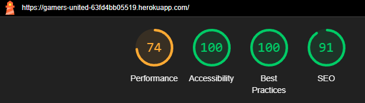
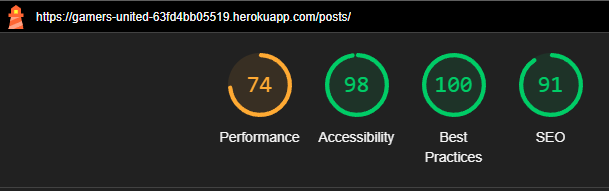
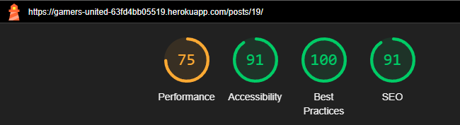
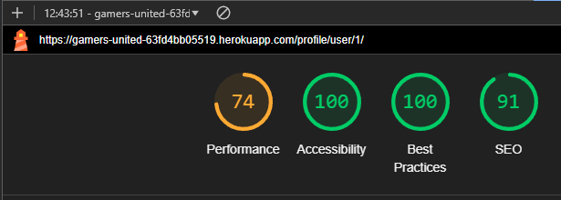

# Gamers United Testing


Return back to the [README.md](README.md) file.

## CONTENT

- [Testing overview & environment](#testing-overview--environment)
    - [Test environment](#test-environment)
    - [Browser compatibility](#browser-compatibility)
    - [Responsiveness](#responsiveness)
- [Automated Testing](#automated-testing)
- [Code Validation](#code-validation)
- [Lighthouse](#lighthouse)
- [Manual test](#manual-test)
    - [Function Test](#function-test)
- [ISSUES](#issues)
    - [Solved Issues](#solved-issues)
    - [Unsolved issue](#unsolved-issue)
    - [Known issue](#known-issue)

## Automated Testing

- **HTML Validation**: Used the [W3C HTML Validator](https://validator.w3.org/) which returned the following results:
  <div style="text-align: center; margin: 10px 0;">
      
  </div>

- **CSS Validation**: Used the [W3C CSS Validator](https://jigsaw.w3.org/css-validator/) which returned the following results:
  <div style="text-align: center; margin: 10px 0;">
      
  </div>

- **JavaScript Validation**: Used [JSHint](https://jshint.com/) to validate JavaScript code. The validation process returned a clean report compliant with ES6+ standards.

### Lighthouse scores

Lighthouse metrics were scored on Incognito Chrome

<div style="text-align: center;">
    
    
    
    
    
    
</div>

- **Jest**: A JavaScript testing framework used for unit and integration tests.
- **Django Test Framework**: The built-in testing framework for Django applications.

### Running Tests

Make sure to include the correct versions for both JavaScript & Django testing.

JavaScript -> `package.json`

Django -> `requirements.txt`

On the terminal write the commands below:

```bash
# For javascript
npm test

# For Django
python3 manage.py test
```

- **JavaScript Testing**: The JavaScript tests returned the following results:
  <div style="text-align: center; margin: 10px 0;">
      
  </div>

- **Django Testing**: The Django tests for the application returned the following results:


## Manual Testing

<details>
    <summary><strong>Navigation & Footer</strong></summary>
    <table>
        <thead>
            <tr>
                <th>Test Name</th>
                <th>Steps</th>
                <th>Expected Result</th>
                <th>Actual Result</th>
                <th>Pass/Fail</th>
            </tr>
        </thead>
        <tbody>
            <tr>
                <td>Home Navigation</td>
                <td>
                    1. Click on the <em>Home</em> text.<br>
                </td>
                <td>User is redirected to the homepage (index.html).</td>
                <td>[Same as Expected]</td>
                <td>&#10003;</td>
            </tr>
            <tr>
                <td>Profile Navigation</td>
                <td>
                    1. Click on the <em>Profile</em> link.
                </td>
                <td>User is redirected to the profile page (profile.html).</td>
                <td>[Same as Expected]</td>
                <td>&#10003;</td>
            </tr>
            <tr>
                <td>Sign up Navigation</td>
                <td>
                    1. Click on the <em>Sign up</em> link.
                </td>
                <td>User is redirected to the register page (signup.html).</td>
                <td>[Same as Expected]</td>
                <td>&#10003;</td>
            </tr>
            <tr>
                <td>Login Navigation</td>
                <td>
                    1. Click on the <em>Login</em> link.
                </td>
                <td>User is redirected to the login page (login.html).</td>
                <td>[Same as Expected]</td>
                <td>&#10003;</td>
            </tr>
            <tr>
                <td>Logout Navigation</td>
                <td>
                    1. Click on the <em>Logout</em> link.
                </td>
                <td>User is redirected to the logout page (logout.html).</td>
                <td>[Same as Expected]</td>
                <td>&#10003;</td>
            </tr>
            <tr>
                <td>Footer Links</td>
                <td>
                    1. Click on the <em>My LinkedIn</em> link.<br>
                    2. Click on the <em>My GitHub</em> link.
                </td>
                <td>User is redirected to LinkedIn and GitHub pages in new tabs.</td>
                <td>[Same as Expected]</td>
                <td>&#10003;</td>
            </tr>
        </tbody>
    </table>
</details>

<br>

<details>
  <summary><strong>Home Page</strong></summary>
  <table>
    <thead>
      <tr>
        <th>Test Name</th>
        <th>Steps</th>
        <th>Expected Result</th>
        <th>Actual Result</th>
        <th>Pass/Fail</th>
      </tr>
    </thead>
    <tbody>
      <tr>
        <td>Home</td>
        <td>
          1. Navigate to the home page.<br>
        </td>
        <td>User is redirected to the menu page.</td>
        <td>[Same as Expected]</td>
        <td>&#10003;</td>
      </tr>
      <tr>
        <td>Join Now</td>
        <td>
          1. Navigate to the home page.<br>
          2. Click on the <em>See specials</em> button on the "Weekend Special" slide.
        </td>
        <td>User is redirected to the events page.</td>
        <td>[Same as Expected]</td>
        <td>&#10003;</td>
      </tr>
      <tr>
        <td>Happy Hour Carousel</td>
        <td>
          1. Navigate to the home page.<br>
          2. Click on the <em>Join us</em> button on the "Happy Hour" slide.
        </td>
        <td>User is redirected to the happy hour details page.</td>
        <td>[Same as Expected]</td>
        <td>&#10003;</td>
      </tr>
      <tr>
        <td>Welcome Title Visibility</td>
        <td>
          1. Navigate to the home page.
        </td>
        <td><strong><em>Welcome to the Rum Away Bar</em></strong> is visible.</td>
        <td>[Same as Expected]</td>
        <td>&#10003;</td>
      </tr>
      <tr>
        <td>View Our Menu Button</td>
        <td>
          1. Navigate to the home page.<br>
          2. Click on the <em>view our menu</em> button.
        </td>
        <td>User is redirected to the menu page.</td>
        <td>[Same as Expected]</td>
        <td>&#10003;</td>
      </tr>
      
</details>

<br>

<details>
  <summary><strong>Sign-Up</strong></summary>
  
  <table>
    <thead>
      <tr>
        <th>Test Name</th>
        <th>Steps</th>
        <th>Expected Result</th>
        <th>Actual Result</th>
        <th>Pass/Fail</th>
      </tr>
    </thead>
    <tbody>
      <tr>
        <td>Sign-Up Success</td>
        <td>
          1. Navigate to Sign-Up page.<br>
          2. Enter valid credentials.<br>
          3. Submit the form.
        </td>
        <td>User is redirected to homepage with 'Successfully signed up as (username)'.</td>
        <td>[Same as Expected]</td>
        <td>&#10003;</td>
      </tr>
      <tr>
        <td>Password Mismatch</td>
        <td>
          1. Navigate to Sign-Up page.<br>
          2. Enter passwords that don't match.<br>
          3. Submit the form.
        </td>
        <td>Error message 'You must type the same password each time.'.</td>
        <td>[Same as Expected]</td>
        <td>&#10003;</td>
      </tr>
      <tr>
        <td>Invalid Email Format</td>
        <td>
          1. Enter invalid email.<br>
          2. Submit the form.
        </td>
        <td>Error message 'Enter a valid email address'.</td>
        <td>[Same as Expected]</td>
        <td>&#10003;</td>
      </tr>
      <tr>
        <td>Password Too Similar to Personal Information</td>
        <td>
          1. Enter a password similar to personal information (e.g., username or email).<br>
          2. Submit the form.
        </td>
        <td>Error message 'Your password can’t be too similar to your other personal information.'</td>
        <td>[Same as Expected]</td>
        <td>&#10003;</td>
      </tr>
      <tr>
        <td>Password Less Than 8 Characters</td>
        <td>
          1. Enter a password with fewer than 8 characters.<br>
          2. Submit the form.
        </td>
        <td>Error message 'Your password must contain at least 8 characters.'</td>
        <td>[Same as Expected]</td>
        <td>&#10003;</td>
      </tr>
      <tr>
        <td>Commonly Used Password</td>
        <td>
          1. Enter a commonly used password (e.g., 'password123').<br>
          2. Submit the form.
        </td>
        <td>Error message 'This password is too common.'</td>
        <td>[Same as Expected]</td>
        <td>&#10003;</td>
      </tr>
      <tr>
        <td>Password Entirely Numeric</td>
        <td>
          1. Enter a password that is entirely numeric (e.g., '12345678').<br>
          2. Submit the form.
        </td>
        <td>Error message 'Your password can’t be entirely numeric.'</td>
        <td>[Same as Expected]</td>
        <td>&#10003;</td>
      </tr>
      <tr>
        <td>Show/Hide Password Toggle</td>
        <td>
          1. Click on the show/hide password icon.<br>
          2. Verify that the password visibility toggles between hidden and visible.
        </td>
        <td>Password visibility toggles as expected.</td>
        <td>[Same as Expected]</td>
        <td>&#10003;</td>
      </tr>
    </tbody>
  </table>
  
</details>

<br>

<details>
  <summary><strong>Sign In</strong></summary>

  <table>
    <thead>
      <tr>
        <th>Test Name</th>
        <th>Steps</th>
        <th>Expected Result</th>
        <th>Actual Result</th>
        <th>Pass/Fail</th>
      </tr>
    </thead>
    <tbody>
      <tr>
        <td>Navigate to Sign-Up Page</td>
        <td>
          1. Navigate to Sign-In page.<br>
          2. Click on 'sign up' link.<br>
          3. Go to the Sign-Up page.
        </td>
        <td>User is redirected to the Sign-Up page.</td>
        <td>[Same as Expected]</td>
        <td>&#10003;</td>
      </tr>
      <tr>
        <td>Sign-In Success</td>
        <td>
          1. Navigate to Sign-In page.<br>
          2. Enter valid username and password (case-insensitive).<br>
          3. Submit the form.
        </td>
        <td>User is redirected to the homepage with 'Successfully signed in as (username)'.</td>
        <td>[Same as Expected]</td>
        <td>&#10003;</td>
      </tr>
      <tr>
        <td>Incorrect Credentials</td>
        <td>
          1. Navigate to Sign-In page.<br>
          2. Enter invalid username or password.<br>
          3. Submit the form.
        </td>
        <td>Error message 'The username and/or password you specified are not correct.'</td>
        <td>[Same as Expected]</td>
        <td>&#10003;</td>
      </tr>
      <tr>
        <td>Forgot Password Link</td>
        <td>
          1. Navigate to Sign-In page.<br>
          2. Click on 'Forgot your password?' link.
        </td>
        <td>User is redirected to the password recovery page.</td>
        <td>[Same as Expected]</td>
        <td>&#10003;</td>
      </tr>
      <tr>
        <td>Remember Me Checkbox</td>
        <td>
          1. Navigate to Sign-In page.<br>
          2. Enter valid credentials.<br>
          3. Check the 'Remember me' checkbox.<br>
          4. Submit the form.
        </td>
        <td>User remains signed in on next visit.</td>
        <td>[Same as Expected]</td>
        <td>&#10003;</td>
      </tr>
      <tr>
        <td>Empty Credentials</td>
        <td>
          1. Navigate to Sign-In page.<br>
          2. Leave username and password fields empty.<br>
          3. Submit the form.
        </td>
        <td>Error message 'This field is required.'</td>
        <td>[Same as Expected]</td>
        <td>&#10003;</td>
      </tr>
    </tbody>
  </table>

   <div style="text-align: center;">
    
  </div> 
</details>

<br>

<details>
  <summary><strong>Profile Page</strong></summary>

  <table>
    <thead>
      <tr>
        <th>Test Name</th>
        <th>Steps</th>
        <th>Expected Result</th>
        <th>Actual Result</th>
        <th>Pass/Fail</th>
      </tr>
    </thead>
    <tbody>
      <tr>
        <td>Profile Image Visibility</td>
        <td>
          1. Navigate to the profile page.
        </td>
        <td>Profile image is displayed. Default "nobody image" appears if no image is uploaded.</td>
        <td>[Same as Expected]</td>
        <td>&#10003;</td>
      </tr>
      <tr>
        <td>Profile Information Display</td>
        <td>
          1. Navigate to the profile page.
        </td>
        <td>Username, first name, last name, email, bio, and member since date are visible.</td>
        <td>[Same as Expected]</td>
        <td>&#10003;</td>
      </tr>
      <tr>
        <td>Update First Name</td>
        <td>
          1. Navigate to the profile page.<br>
          2. Change the first name input.<br>
          3. Click on <em>Save Changes</em>.
        </td>
        <td>First name is updated successfully.</td>
        <td>[Same as Expected]</td>
        <td>&#10003;</td>
      </tr>
      <tr>
        <td>Update Last Name</td>
        <td>
          1. Navigate to the profile page.<br>
          2. Change the last name input.<br>
          3. Click on <em>Save Changes</em>.
        </td>
        <td>Last name is updated successfully.</td>
        <td>[Same as Expected]</td>
        <td>&#10003;</td>
      </tr>
      <tr>
        <td>Update Email</td>
        <td>
          1. Navigate to the profile page.<br>
          2. Enter a valid email.<br>
          3. Click on <em>Save Changes</em>.
        </td>
        <td>Email is updated successfully.</td>
        <td>[Same as Expected]</td>
        <td>&#10003;</td>
      </tr>
      <tr>
        <td>Invalid Email Error Message</td>
        <td>
          1. Navigate to the profile page.<br>
          2. Enter an invalid email.<br>
          3. Click on <em>Save Changes</em>.
        </td>
        <td>Error message is displayed for invalid email.</td>
        <td>[Same as Expected]</td>
        <td>&#10003;</td>
      </tr>
      <tr>
        <td>Profile Image Upload</td>
        <td>
          1. Navigate to the profile page.<br>
          2. Upload a valid profile image (PNG, JPG, JPEG, GIF, WEBP) under 8MB.<br>
          3. Click on <em>Save Changes</em>.
        </td>
        <td>Profile image is uploaded successfully.</td>
        <td>[Same as Expected]</td>
        <td>&#10003;</td>
      </tr>
      <tr>
        <td>Invalid Profile Image Error Message</td>
        <td>
          1. Navigate to the profile page.<br>
          2. Upload an invalid profile image format or exceed the 8MB size limit.<br>
          3. Click on <em>Save Changes</em>.
        </td>
        <td>Error message is displayed for invalid image format or size.</td>
        <td>[Same as Expected]</td>
        <td>&#10003;</td>
      </tr>
      <tr>
        <td>Bio Character Limit</td>
        <td>
          1. Navigate to the profile page.<br>
          2. Enter a bio exceeding 50 characters.<br>
          3. Click on <em>Save Changes</em>.
        </td>
        <td>Error message is displayed for exceeding bio character limit.</td>
        <td>[Same as Expected]</td>
        <td>&#10003;</td>
      </tr>
      <tr>
        <td>Testimonials Section Visibility</td>
        <td>
          1. Navigate to the profile page.
        </td>
        <td>If no testimonials exist, display message: "No testimonials yet. Share your experiences to inspire others!"</td>
        <td>[Same as Expected]</td>
        <td>&#10003;</td>
      </tr>
      <tr>
        <td>Edit Testimonial Button</td>
        <td>
          1. Navigate to the profile page.<br>
          2. Click on the <em>Edit</em> button for a submitted testimonial.
        </td>
        <td>User is redirected to the edit testimonial page.</td>
        <td>[Same as Expected]</td>
        <td>&#10003;</td>
      </tr>
      <tr>