# Gamers United Testing

Return back to the [README.md](README.md) file.

## CONTENT

- [Testing overview & environment](#testing-overview--environment)
    - [Test environment](#test-environment)
    - [Browser compatibility](#browser-compatibility)
    - [Responsiveness](#responsiveness)
- [Automated Testing](#automated-testing)
- [Code Validation](#code-validation)
- [Lighthouse](#lighthouse)
- [Manual test](#manual-test)
- [ISSUES](#issues)
    - [Solved Issues](#solved-issues)
    - [Unsolved issue](#unsolved-issue)
    - [Known issue](#known-issue)

## Testing overview & environment

Testing was ongoing throughout the entire development. I used the various linters and GITPOD terminal output whilst building to pinpoint and troubleshoot any issues as I went along.

### Test environment

* Desktop:
  * Self built PC
* Screen:
  * Samsung Odyssey G5 / 32" / 2560 x 1440 /
* Mobile:
  * Iphone 13 PRO

### Browser compatibility

* Google Chrome, version 121.0.6167.86 (Official Build) (64-bit)
* Edge, version 123.0.2420.97 (Official build) (64-bit)

### Responsiveness

App is fully responsive on breakpoints supported by Bootstrap 5.3.3.

| **Breakpoint** | **Prefix** | **Minimum Width** |
|----------------|------------|-------------------|
| Extra Small    | `xs`       | `< 576px`         |
| Small          | `sm`       | `≥ 576px`         |
| Medium         | `md`       | `≥ 765px`         |
| Large          | `lg`       | `≥ 992px`         |
| Extra Large    | `xl`       | `≥ 1200px`        |
| Extra Extra Large | `xxl`   | `≥ 1400px`        |

*[Back to Content](#content)*

## Automated Testing

- **HTML Validation**: Used the [W3C HTML Validator](https://validator.w3.org/nu/?doc=https%3A%2F%2Fgamers-united-63fd4bb05519.herokuapp.com%2F) which returned the following results:
  

      
  

- **CSS Validation**: Used the [W3C CSS Validator](https://jigsaw.w3.org/css-validator/) which returned the following results:
  

      
  

- **JavaScript Validation**: Used [JSHint](https://jshint.com/) to validate JavaScript code. The validation process returned a clean report compliant with ES6+ standards.

*[Back to Content](#content)*

## Code Validation

### HTML

All HTML files were validated using the recommended [HTML W3C Validator](https://validator.w3.org).

Exceptions:

The presence of Jinja templates in the code, which include syntax like , , and {{ variable|filter }}, means that direct copy-pasting from source files does not validate correctly.

Normally, the [validate by URI method](https://validator.w3.org/#validate_by_uri) on deployed Heroku pages is suggested. However, this approach is impractical for my project because most pages require user login, and the W3C HTML Validator cannot access these authenticated pages.

**Alternative Validation Approach:**

To validate HTML pages that incorporate Jinja syntax and require authentication, I followed these steps:

Navigate to the authenticated pages on the deployed site.
Right-click on the page and select View Page Source (shortcut CTRL+U or ⌘+U on Mac).
This reveals the fully rendered HTML, free of Jinja syntax.
Copy this HTML and paste it into the validate by input section of the W3C validator.
This procedure was repeated for each authenticated page.

Validation Images

 

#### Landing non authenticated

#### About us

#### Sign Up

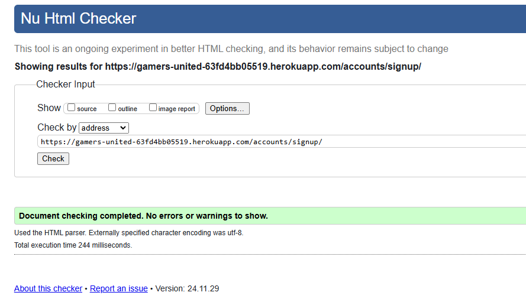

#### Log In

#### Profle Page

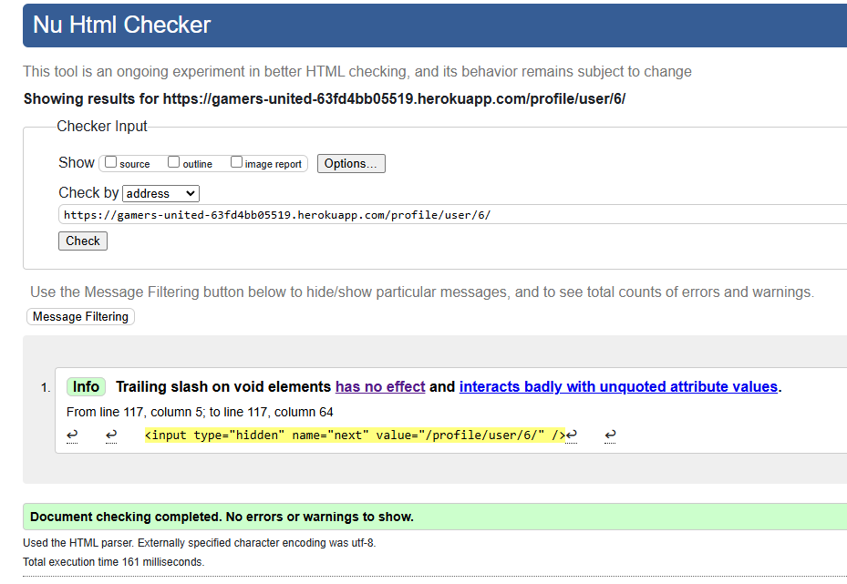

#### Add Post

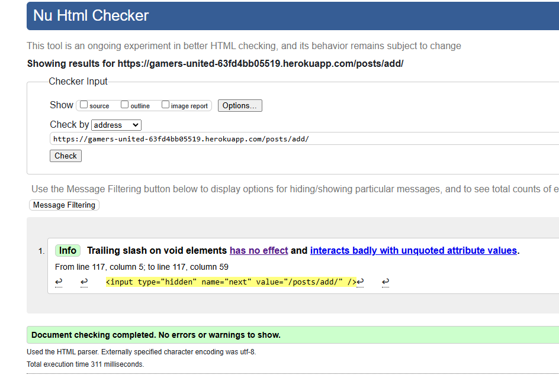

#### Edit Post

#### Posts Page

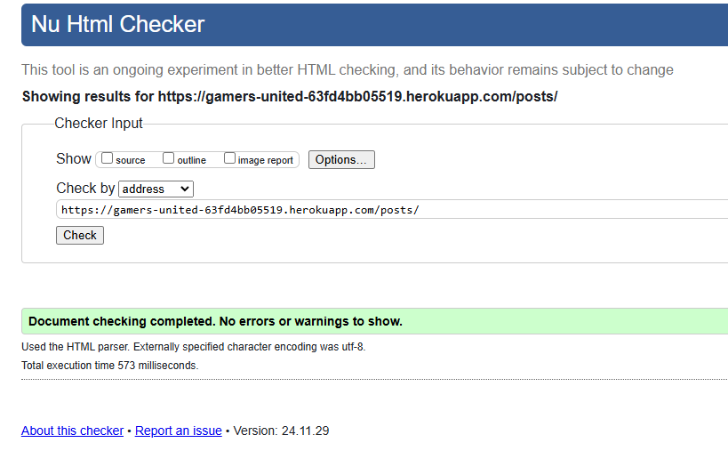

#### Post Detail

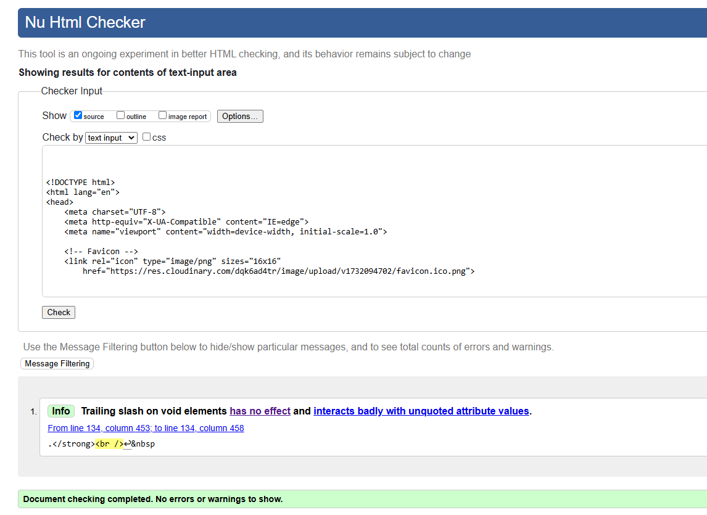

#### Confirm Delete

#### Log Out

#### Reset Password

I had to validate the post detail page differently due to needing to be logged in to view them.

*[Back to Content](#content)*

### CSS

[CSS Jigsaw Validator](https://jigsaw.w3.org/css-validator) was used to to validate the CSS file(s).

### Python

The recommended [CI Python Linter](https://pep8ci.herokuapp.com) was to validate all Python files.

 

*[Back to Content](#content)*

## Lighthouse

Lighthouse Desktop

 

Lighthouse was measured on Desktop.

### Landing non authenticated

#### Abous Us

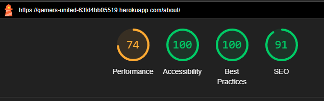

### Sign Up

### Log In

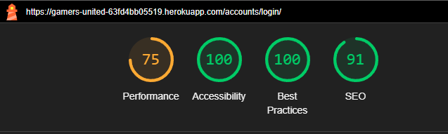

### Profile

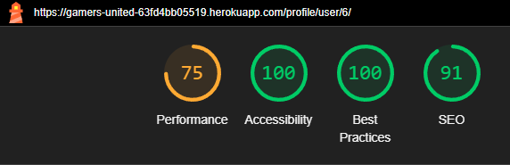

### Post Details

### Add Post

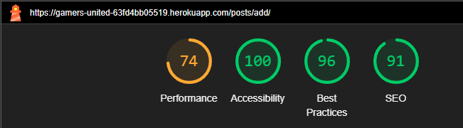

### Posts Page

### Confirm Delete

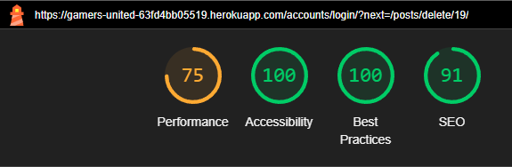

### Log Out

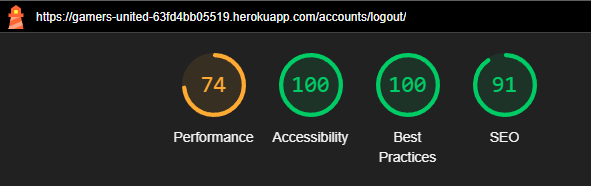

 

*[Back to Content](#content)*

## Manual Testing

    
<strong>Navigation & Footer</strong>

    <table>
        <thead>
            <tr>
                <th>Test Name</th>
                <th>Steps</th>
                <th>Expected Result</th>
                <th>Actual Result</th>
                <th>Pass/Fail</th>
            </tr>
        </thead>
        <tbody>
            <tr>
                <td>Home Navigation</td>
                <td>
                    1. Click on the <em>Home</em> link.</em>. 
                </td>
                <td>User is redirected to the homepage (index.html).</td>
                <td>[Same as Expected]</td>
                <td>&#10003;</td>
            </tr>
            <td>About Us Navigation</td>
                <td>
                    1. Click on the <em>About Us</em> link.</em>. 
                </td>
                <td>User is redirected to the about us page (about.html).</td>
                <td>[Same as Expected]</td>
                <td>&#10003;</td>
            </tr>
            <td>Posts Navigation</td>
                <td>
                    1. Click on the <em>Posts</em> link.</em>. 
                </td>
                <td>User is redirected to the posts page (posts.html).</td>
                <td>[Same as Expected]</td>
                <td>&#10003;</td>
            </tr>
            <td>Add Post Navigation</td>
                <td>
                    1. Click on the <em>Add post</em> link.</em>. 
                </td>
                <td>User is redirected to the add post page (add_post.html).</td>
                <td>[Same as Expected]</td>
                <td>&#10003;</td>
            </tr>
            <tr>
                <td>Profile Navigation</td>
                <td>
                    1. Click on the <em>Profile</em> link.
                </td>
                <td>User is redirected to the profile page (profile.html).</td>
                <td>[Same as Expected]</td>
                <td>&#10003;</td>
            </tr>
            <tr>
                <td>Sign Up Navigation</td>
                <td>
                    1. Click on the <em>Sign Up</em> link.
                </td>
                <td>User is redirected to the register page (signup.html).</td>
                <td>[Same as Expected]</td>
                <td>&#10003;</td>
            </tr>
            <tr>
                <td>Login Navigation</td>
                <td>
                    1. Click on the <em>Login</em> link.
                </td>
                <td>User is redirected to the login page (login.html).</td>
                <td>[Same as Expected]</td>
                <td>&#10003;</td>
            </tr>
            <tr>
                <td>Logout Navigation</td>
                <td>
                    1. Click on the <em>Logout</em> link.
                </td>
                <td>User is redirected to the logout page (logout.html).</td>
                <td>[Same as Expected]</td>
                <td>&#10003;</td>
            </tr>
            <tr>
                <td>Footer Links</td>
                <td>
                    1. Click on the <em>Twitch</em> link. 
                    2. Click on the <em>Instagram</em> link. 
                    3. Click on the <em>Twitter</em> link. 
                    4. Click on the <em>Youtube</em> link. 
                </td>
                <td>User is redirected to Twitch, Instagram, Twitter, Youtube pages in new tabs.</td>
                <td>[Same as Expected]</td>
                <td>&#10003;</td>
            </tr>
        </tbody>
    </table>

 

  
<strong>Home Page</strong>

  <table>
    <thead>
      <tr>
        <th>Test Name</th>
        <th>Steps</th>
        <th>Expected Result</th>
        <th>Actual Result</th>
        <th>Pass/Fail</th>
      </tr>
    </thead>
    <tbody>
      <tr>
        <td>Join Now Button</td>
        <td>
          1. Navigate to the home page.  
          2. Click Join Now button
        </td>
        <td><em>User is redirected to Sign Up page</em>.</td>
        <td>[Same as Expected]</td>
        <td>&#10003;</td>
      </tr>
      <tr>
        <td>Footer Visibility</td>
        <td>
          1. Navigate to the home page.
        </td>
        <td>Footer with a purple background and white icons is visible.</td>
        <td>[Same as Expected]</td>
        <td>&#10003;</td>
      </tr>
    </tbody>
  </table>

 

  
<strong>About Us Page</strong>

  <table>
    <thead>
      <tr>
        <th>Test Name</th>
        <th>Steps</th>
        <th>Expected Result</th>
        <th>Actual Result</th>
        <th>Pass/Fail</th>
      </tr>
    </thead>
    <tbody>
      <tr>
        <td>About Us Page unauthenticated</td>
        <td>
          1. Click on the About Us Page.
        </td>
        <td>A informative about us text and a "Join Now" button is visible for non-registered users</td>
        <td>[Same as Expected]</td>
        <td>&#10003;</td>
      </tr>
      <td>About Us Page authenticated</td>
        <td>
          1. Click on the About Us Page.
        </td>
        <td>A informative about us text <strong>without</strong> the ''Join Now'' button for authenticated users.</td>
        <td>[Same as Expected]</td>
        <td>&#10003;</td>
      </tr>
      <td>Join Now Button</td>
        <td>
          1. Click on the About Us Page. 
          2. Click on the "Join Now" button visible for <strong>unauthenticated users</strong>.
        </td>
        <td>The user gets redirected to the Sign Up page.</td>
        <td>[Same as Expected]</td>
        <td>&#10003;</td>
      </tr>
    </tbody>
  </table>

 

  
<strong>Sign-Up</strong>

  
  <table>
    <thead>
      <tr>
        <th>Test Name</th>
        <th>Steps</th>
        <th>Expected Result</th>
        <th>Actual Result</th>
        <th>Pass/Fail</th>
      </tr>
    </thead>
    <tbody>
      <tr>
        <td>Sign-Up Success</td>
        <td>
          1. Navigate to Sign-Up page. 
          2. Enter valid credentials. 
          3. Submit the form.
        </td>
        <td>User is redirected to homepage with 'Successfully signed in as (username)'.</td>
        <td>[Same as Expected]</td>
        <td>&#10003;</td>
      </tr>
      <tr>
        <td>Password Mismatch</td>
        <td>
          1. Navigate to Sign-Up page. 
          2. Enter passwords that don't match. 
          3. Submit the form.
        </td>
        <td>Error message 'You must type the same password each time.'.</td>
        <td>[Same as Expected]</td>
        <td>&#10003;</td>
      </tr>
      <tr>
        <td>Invalid Email Format</td>
        <td>
          1. Enter invalid email. 
          2. Submit the form.
        </td>
        <td>Error message 'Enter a valid email address'.</td>
        <td>[Same as Expected]</td>
        <td>&#10003;</td>
      </tr>
      <tr>
        <td>Password Too Similar to Personal Information</td>
        <td>
          1. Enter a password similar to personal information (e.g., username or email). 
          2. Submit the form.
        </td>
        <td>Error message 'Your password can’t be too similar to your other personal information.'</td>
        <td>[Same as Expected]</td>
        <td>&#10003;</td>
      </tr>
      <tr>
        <td>Password Less Than 8 Characters</td>
        <td>
          1. Enter a password with fewer than 8 characters. 
          2. Submit the form.
        </td>
        <td>Error message 'Your password must contain at least 8 characters.'</td>
        <td>[Same as Expected]</td>
        <td>&#10003;</td>
      </tr>
      <tr>
        <td>Commonly Used Password</td>
        <td>
          1. Enter a commonly used password (e.g., 'password123'). 
          2. Submit the form.
        </td>
        <td>Error message 'This password is too common.'</td>
        <td>[Same as Expected]</td>
        <td>&#10003;</td>
      </tr>
      <tr>
        <td>Password Entirely Numeric</td>
        <td>
          1. Enter a password that is entirely numeric (e.g., '12345678'). 
          2. Submit the form.
        </td>
        <td>Error message 'Your password can’t be entirely numeric.'</td>
        <td>[Same as Expected]</td>
        <td>&#10003;</td>
      </tr>
      <tr>
    </tbody>
  </table>
  

 

  
<strong>Log In</strong>

  <table>
    <thead>
      <tr>
        <th>Test Name</th>
        <th>Steps</th>
        <th>Expected Result</th>
        <th>Actual Result</th>
        <th>Pass/Fail</th>
      </tr>
    </thead>
    <tbody>
      <tr>
        <td>Navigate to Sign-In Page</td>
        <td>
          1. Navigate to Sign-In page. 
          2. Click on 'sign in' link. 
          3. Go to the Sign-In page.
        </td>
        <td>User is redirected to the Sign-In page.</td>
        <td>[Same as Expected]</td>
        <td>&#10003;</td>
      </tr>
      <tr>
        <td>Sign-In Success</td>
        <td>
          1. Navigate to Sign-In page. 
          2. Enter valid username and password (case-insensitive). 
          3. Submit the form.
        </td>
        <td>User is redirected to the homepage with 'Successfully signed in as (username)'.</td>
        <td>[Same as Expected]</td>
        <td>&#10003;</td>
      </tr>
      <tr>
        <td>Incorrect Credentials</td>
        <td>
          1. Navigate to Sign-In page. 
          2. Enter invalid username or password. 
          3. Submit the form.
        </td>
        <td>Error message 'The username and/or password you specified are not correct.'</td>
        <td>[Same as Expected]</td>
        <td>&#10003;</td>
      </tr>
      <tr>
        <td>Forgot Password Link</td>
        <td>
          1. Navigate to Sign-In page. 
          2. Click on 'Forgot your password?' link.
        </td>
        <td>User is redirected to the password recovery page.</td>
        <td>[Same as Expected]</td>
        <td>&#10003;</td>
      </tr>
      <tr>
        <td>Remember Me Checkbox</td>
        <td>
          1. Navigate to Sign-In page. 
          2. Enter valid credentials. 
          3. Check the 'Remember me' checkbox. 
          4. Submit the form.
        </td>
        <td>User remains signed in on next visit.</td>
        <td>[Same as Expected]</td>
        <td>&#10003;</td>
      </tr>
      <tr>
        <td>Empty Credentials</td>
        <td>
          1. Navigate to Sign-In page. 
          2. Leave username and password fields empty. 
          3. Submit the form.
        </td>
        <td>Error message 'This field is required.'</td>
        <td>[Same as Expected]</td>
        <td>&#10003;</td>
      </tr>
    </tbody>
  </table>

 

  
<strong>Log Out</strong>

  <table>
    <thead>
      <tr>
        <th>Test Name</th>
        <th>Steps</th>
        <th>Expected Result</th>
        <th>Actual Result</th>
        <th>Pass/Fail</th>
      </tr>
    </thead>
    <tbody>
      <tr>
        <td>Navigate to Log out Page</td>
        <td>
          1. Navigate to Log out page. 
          2. Click on 'sign out' button. 
        </td>
        <td>User is redirected to the homepage with a text 'You have signed out.'.</td>
        <td>[Same as Expected]</td>
        <td>&#10003;</td>
      </tr>
    </tbody>
  </table>

 

  
<strong>Profile Page</strong>

  <table>
    <thead>
      <tr>
        <th>Test Name</th>
        <th>Steps</th>
        <th>Expected Result</th>
        <th>Actual Result</th>
        <th>Pass/Fail</th>
      </tr>
    </thead>
    <tbody>
      <tr>
        <td>Profile Image Visibility</td>
        <td>
          1. Navigate to the profile page.
        </td>
        <td>Profile image is displayed. Default "nobody image" appears if no image is uploaded.</td>
        <td>[Same as Expected]</td>
        <td>&#10003;</td>
      </tr>
      <tr>
        <td>Profile Information Display</td>
        <td>
          1. Navigate to the profile page.
        </td>
        <td>Username, bio, total posts, country, and joined date are visible.</td>
        <td>[Same as Expected]</td>
        <td>&#10003;</td>
      </tr>
      <tr>
        <td>Profile Image Upload</td>
        <td>
          1. Navigate to the profile page. 
          2. Upload a valid profile image (PNG). 
          3. Click on <em>Edit</em>.
        </td>
        <td>Profile image is uploaded successfully.</td>
        <td>[Same as Expected]</td>
        <td>&#10003;</td>
      </tr>
       <tr>
        <td>My Posts on profile page</td>
        <td>
          1. Navigate to the profile page.  
          2. Click on the desired post if there is any that exists.
        </td>
        <td>User is redirected to the post detail page.</td>
        <td>[Same as Expected]</td>
        <td>&#10003;</td>
      </tr>
      <tr>
        <td>Bio Character Limit</td>
        <td>
          1. Navigate to the profile page. 
          2. Enter a bio exceeding 150 characters. 
          3. Click on <em>Edit</em>.
        </td>
        <td>User can't type more letters after exceeding bio character limit.</td>
        <td>[Same as Expected]</td>
        <td>&#10003;</td>
      </tr>
    </tbody>
  </table>
  

 

  
<strong>Posts Page</strong>

  <table>
    <thead>
      <tr>
        <th>Test Name</th>
        <th>Steps</th>
        <th>Expected Result</th>
        <th>Actual Result</th>
        <th>Pass/Fail</th>
      </tr>
    </thead>
    <tbody>
      <tr>
        <td>Game Category Dropdown Menu Functionality</td>
        <td>
          1. Click on the dropdown to select a game category. 
          2. Click on it again or click outside of the dropdown to close it. 
          3. Press the <strong>Esc</strong> key.
        </td>
        <td>The game category dropdown closes.</td>
        <td>[Same as Expected]</td>
        <td>&#10003;</td>
      </tr>
      <td>Sort Game Category Selection</td>
        <td>
          1. Click on the dropdown to select a game category. 
          2. Choose one game category. 
          <td>Shows the chosen game category for the reliable post</td>
        </td>
      <tr>
        <td>Navigation to each post</td>
        <td>
          1. Click on a post card. 
          2. Get redirected to the post detail page. 
          3. In the post detail page, the owner of the post can edit and delete a post  
          and their own comment.
        </td>
        <td>Returns to the category modal displaying the selected drinks.</td>
        <td>[Same as Expected]</td>
        <td>&#10003;</td>
      </tr>
      <tr>
      <tr>
        <td>Image Placeholder for Missing Post Images</td>
        <td>
          1. Upload a post without an image.
        </td>
        <td>A placeholder text with ''no image available'' in the post card display.</td>
        <td>[Same as Expected]</td>
        <td>&#10003;</td>
      </tr>
    </tbody>
  </table>

 

  
<strong>Add Post Page</strong>

  <table>
    <thead>
      <tr>
        <th>Test Name</th>
        <th>Steps</th>
        <th>Expected Result</th>
        <th>Actual Result</th>
        <th>Pass/Fail</th>
      </tr>
    </thead>
    <tbody>
      <tr>
        <td>Game Category Dropdown Menu Functionality</td>
        <td>
          1. Click on the dropdown to select a game category. 
          2. Click on it again or click outside of the dropdown to close it. 
          3. Press the <strong>Esc</strong> key.
        </td>
        <td>The game category dropdown closes.</td>
        <td>[Same as Expected]</td>
        <td>&#10003;</td>
      </tr>
      <td>Sort Game Category Selection</td>
        <td>
          1. Click on the dropdown to select a game category. 
          2. Choose one game category. 
          <td>Shows the chosen game category for the reliable post</td>
        </td>
      <tr>
        <td>Navigation to each post</td>
        <td>
          1. Click on a post card. 
          2. Get redirected to the post detail page. 
          3. In the post detail page, the owner of the post can edit and delete a post  
          and their own comment.
        </td>
        <td>Returns to the category modal displaying the selected drinks.</td>
        <td>[Same as Expected]</td>
        <td>&#10003;</td>
      </tr>
      <tr>
      <tr>
        <td>Image Placeholder for Missing Post Images</td>
        <td>
          1. Upload a post without an image.
        </td>
        <td>A placeholder text with ''no image available'' in the post card display.</td>
        <td>[Same as Expected]</td>
        <td>&#10003;</td>
      </tr>
    </tbody>
  </table>

*[Back to Content](#content)*

## ISSUES

### Solved Issues

1. Adding a post with an image     
By removing the force_format="WEBP" the CRUD issue was solved.

*[Back to Content](#content)*